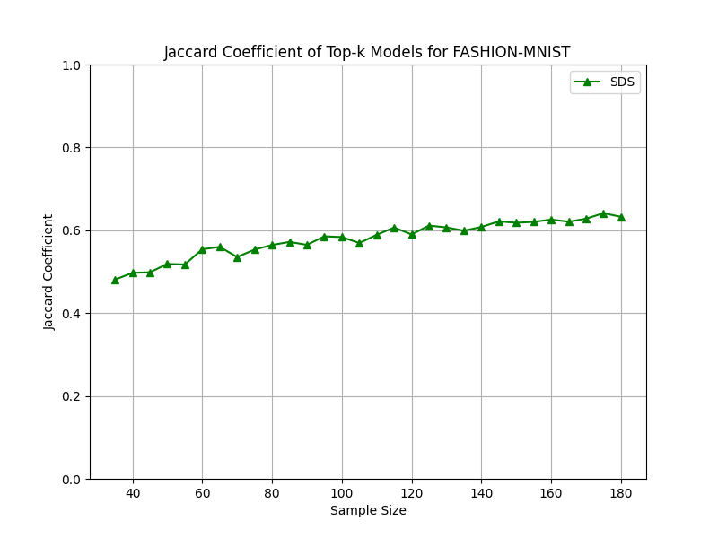
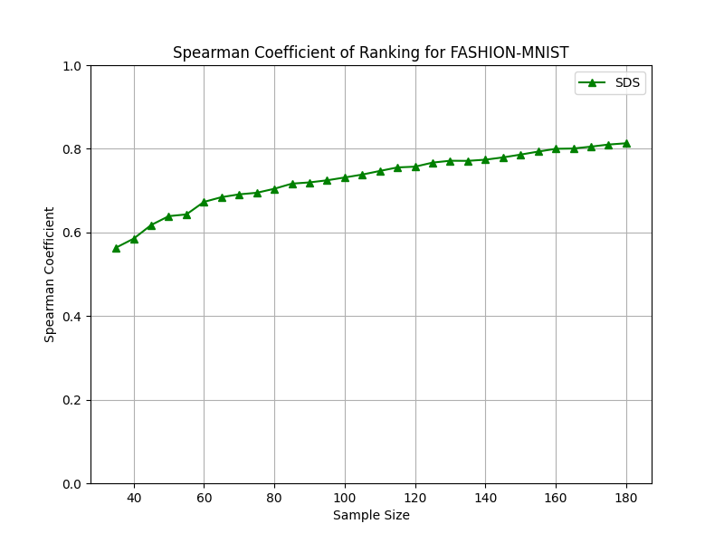

 Sample Discrimination Strategy for Model algorithm is implemented in reference to the original paper by Linghan meng. Modifications have been added to complete the pipeline for evaluation of jaccard and spearman plots missing in the original Repo. Read the paper here: https://arxiv.org/abs/2103.04333

## 📌 Overview
This repository implements the **Sample Discrimination Strategy (SDS)** for evaluating model performance and selecting the most informative test samples.  
The method ranks models based on agreement with the majority vote, identifies discriminative samples, and compares model consistency using **Jaccard** and **Spearman** coefficients.  

By applying SDS to the **FASHION-MNIST** dataset, we aim to:  
- Identify high-discrimination samples that best differentiate models.  
- Compare stability of top-*k* models across different sample sizes.  
- Quantify ranking consistency between experiments.  

---

## ✨ Key Features
- **Automated Model Loading** – Loads multiple trained Keras models from disk.  
- **Majority Voting Evaluation** – Computes majority predictions across models for each sample.  
- **Model Ranking** – Sorts models based on agreement with the majority vote.  
- **Sample Discrimination Analysis** – Selects samples that most differentiate top and bottom ranked models.  
- **Random Sampling Experiments** – Tests model stability with repeated random subsets of discriminative samples.  
- **Metric Visualization** – Plots Jaccard and Spearman coefficients vs. sample size.  

---

## 📊 Results
### 1️⃣ Jaccard Coefficient of Top-*k* Models
The Jaccard coefficient measures the similarity between sets of top-*k* models selected in different runs.  
- **Trend:** Increases steadily with sample size, indicating improved stability of top model selection as more samples are used.
    

### 2️⃣ Spearman Coefficient of Ranking
The Spearman rank correlation measures consistency between complete model rankings across experiments.  
- **Trend:** Rises with sample size, showing that rankings stabilize as more discriminative samples are included.
-   

